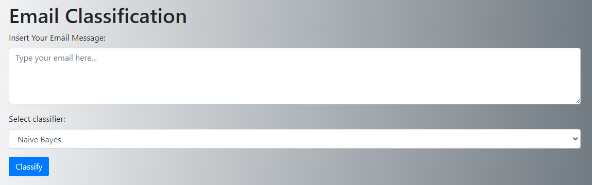
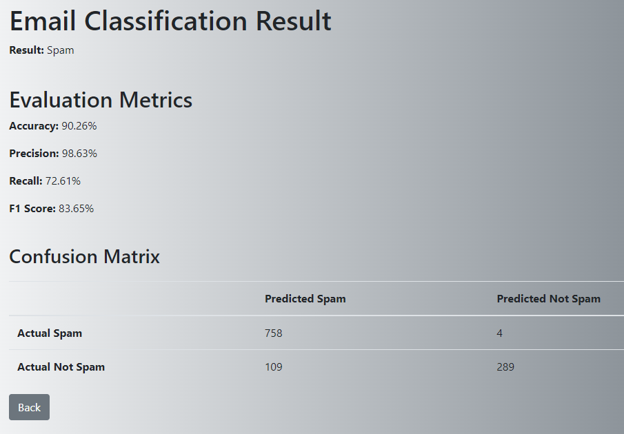

# Email Spam Classifier

The aim of the project is to create a graphical application to classify spam emails. The application will analyse
the content of emails and assign them a label to determine whether they are spam or not. The learning data was provided
in a `/data/spam_NLP.csv` file, which contains the content of the emails and the corresponding labels (spam/non-spam).

## Table of Contents
- [Description](#description)
- [Installation](#installation)
- [Usage](#usage)
- [Tests](#tests)
- [License](#license)


## Description

The application uses the Naive Bayes algorithm to classify spam emails. Based on the provided learning data 
(`/data/spam_NLP.csv`), the application trains a model, which is then used to classify new emails. The application 
features a graphical interface that allows users to use the tool easily and intuitively.


## Installation

Follow these steps to install the project:

1. Clone the repository:
```bash
git clone https://github.com/konfle/ahe_ipd_nlp.git
```

2. Navigate to the project directory:
```bash
cd ahe_ipd_nlp\app
```

3. Install the required dependencies:
```bash
pip install -r requirements.txt
```
   
## Usage

Running the GUI Application:
```bash
python .\app.py
```

Application running on:
```bash
(...)
* Running on http://127.0.0.1:5000
(...)
```

Using the Classifier in Code:
```Python
from nb_classifier import NaiveBayesClassifier

classifier = NaiveBayesClassifier(file_path="../data/spam_NLP.csv", text_column="MESSAGE", label_column="CATEGORY")
classifier.train()

email = "Sample email content to classify"
prediction = classifier.predict(email)
print(f'This email is: {"Spam" if prediction == 1 else "Not spam"}')
```

### GUI Overview

Below is a screenshot of the graphical user interface of the application.

Input data form view:

- text field to insert email content
- dropdown list to choose classifier, Naive Bayes by default
- button "Classify" to start classification



Classification result view:

- email classification result possible results are Spam or Not Spam
- evaluation metrics as percentages
  - accuracy
  - precision
  - recall
  - F1 score
- confusion matrix
- button "Back" to return to the input data form



# Tests

To run tests:
```bash
python -m unittest .\tests\test_data_utils.py
```


# License
This project is licensed under the [MIT License](LICENSE).
